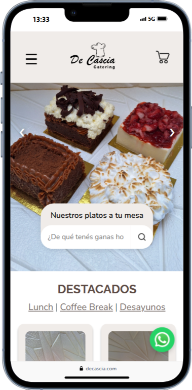

 

<h1 align="center">DE CASCIA</h1>
🔗 **Visítalo aquí:** [Ver sitio web](https://decascia.com/)
###

<h2 align="left">E-commerce design & development - Catering company</h2>

###

<h4 align="left">- UX-UI Design - E-commerce personalized, multipage style - Responsive - Brand identity adaptation - Animated sliders, google maps, social media buttons, contact form & more - SEO optimization</h4>

###

<h2 align="left">Tools used:</h2>

###

  
  
  
  
  
  
  
  
  
  
  

###

  

###
## 📫 Contacto
Contactanos en [komet.sys@gmail.com](mailto:komet.sys@gmail.com)
